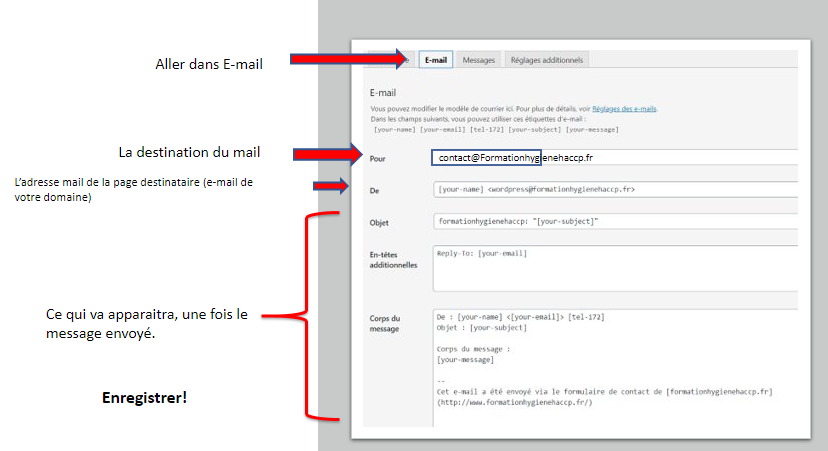
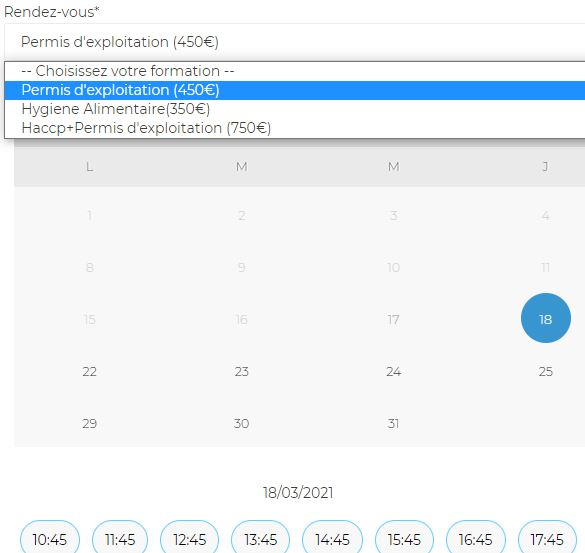
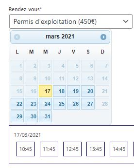
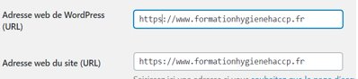

# 
Creation d'un site web WordPress

## Sommaire
1. [Presentation](#presentation)
2. [Outils](#Outils)
3. [Téléverser un Thème](#TeleverserTheme)
4. [Modifier avec Elementor](#Elementor)
5. [Contact](#Pagecontact)
6. [Reservation](#Reservation)
7. [Mettre son site en HTTPS](#HTTPS)

## Presentation
***
 Le but de ce projet est de réaliser un site web en WordPress permettant la réservation de formation dans le domaine de l'hygiène alimentaire.

## Outils
*** 

* Wordpress 5.6
* Plugins Elementor

## TeleverserTheme
***

## Ajouter Template
***
* Pour notre part, nous avons acheté un template sur:​

https://www.templatemonster.com/fr/type/themes-wordpress/​

* Rendez-vous sur le tableau de bord Wordpress​

* Apparences -> Thèmes -> Nouveau​ -> « Téléverser un thème » ​

* Dézippez le 1er dossier ​

* Un dossier Thème apparaît, entrez-y!​

* Sélectionnez le thème que vous avez acheté ​mais gardez le zippé ​

* Appuyez sur ouvrir en bas à droite​

* Activez le thème et le tour est joué!​

## Elementor
***
Elementor est un constructeur de page pour WordPress qui se présente sous la forme d'un plugin. Il permet de concevoir des pages complexes sur WordPress sans coder, grâce à l'utilisation de modèles de page tout prêts ou en partant de zéro, à ajouter en glisser déposer dans votre contenu.

## Pagecontact
***
Formulaire contact |  Code Formulaire
:-------------------------:|:-------------------------:
| | 
s
* Configurer l'espace mail

## Reservation 
***
Pour la réservation en ligne, j'ai utilisé le plugin ***appointment hour booking*** 
 

 Facile d'utilisation, il suffit de placer les différents composants que l'on souhaiteet le tour est joué! 
 Resultat Reservation           |  Avec le plugin
:-------------------------:|:-------------------------:
|         | 

## HTTPS
***
* Une fois le SSL activé sur votre site​

* Vérifions si cela a bien été fait!​

* Tapez dans la barre de recherche Google le nom de votre domaine précédé par: https:// ​

* Si le site correspond bien au votre alors le cadenas devrait apparaître.​

* Rendez- vous maintenant sur WordPress.​

* Allez dans les réglages –> Général​
​
* Changer le HTTP en HTTPS et enregistrez vos ​
modifications. ​

[Sommaire](#Sommaire)

