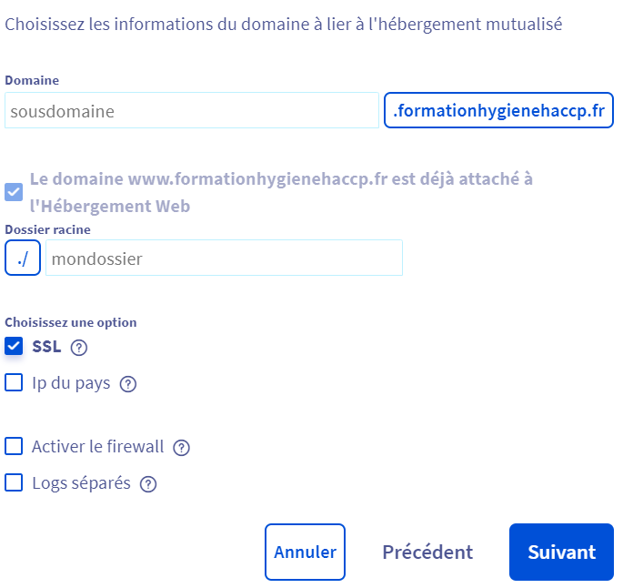

# 
Hébergement OVH

## Sommaire
1. [Presentation](#presentation)
2. [Acheter nom de domaine](#AcheterNomDomaine)
3. [Ajouter un Domaine à votre hébergement](#AjouterDomaine)
4. [Choix du Domaine](#ChoixDomaine)

## AcheterNomDomaine
***
* Connectez-vous sur <a href ="https://www.ovh.com/auth/?action=gotomanager&from=https://www.ovh.com/fr/&ovhSubsidiary=fr">OVH Cloud</a>
* Appuyez sur ***Web Cloud*** 

* Commandez -> Nom de domaine 
 
*! Si vous avez déjà un hébergement, éviter d’en acheter un 2ème et appuyer sur suivant​*

## AjouterDomaine
***
* Se rendre sur l’hébergement que vous souhaitez​
 
* Puis *Multisite*
* Ajouter un domaine ou sous domaine 
 
* Et enfin Sélectionnez le domaine

## ChoixDomaine
***
* Choisissez un sous domaine pour votre site (Voir image ci-dessous)

*Le dossier racine où vous souhaitez mettre le site ( de préférence différent du 1er site)* ​

***Exemple:*** Dossier racine 1er site: WWW​

***Exemple*** Dossierracine 2ème site: WWW2​

* Cochez SSL (https) et si besoin FireWall​

* Puis Suivant ​

* Cochez Configuration automatique ​

* Revenez sur multisite et votre domaine a bien été ajouter ​

* Générer le SSL pour votre nouveau  domaine (attendre 1h)​
 
