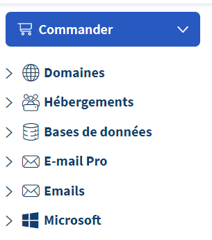
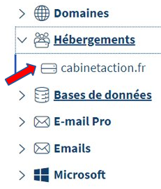

# 
Hébergement OVH

## Sommaire
1. [Presentation](#presentation)
2. [Acheter nom de domaine](#AcheterNomDomaine)
3. [Ajouter un Domaine à votre hébergement](#AjouterDomaine)

## AcheterNomDomaine
***
* Connectez-vous sur <a href ="https://www.ovh.com/auth/?action=gotomanager&from=https://www.ovh.com/fr/&ovhSubsidiary=fr">OVH Cloud</a>
* Appuyez sur ***Web Cloud*** 

* Commandez -> Nom de domaine 
 
*! Si vous avez déjà un hébergement, éviter d’en acheter un 2ème et appuyer sur suivant​*

## AjouterDomaine
* Se rendre sur l’hébergement que vous souhaitez​
 
* Puis *Multisite*
* 